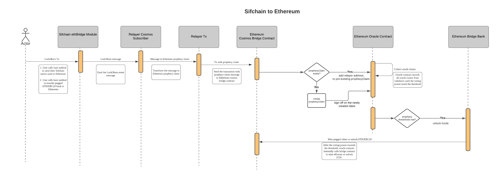
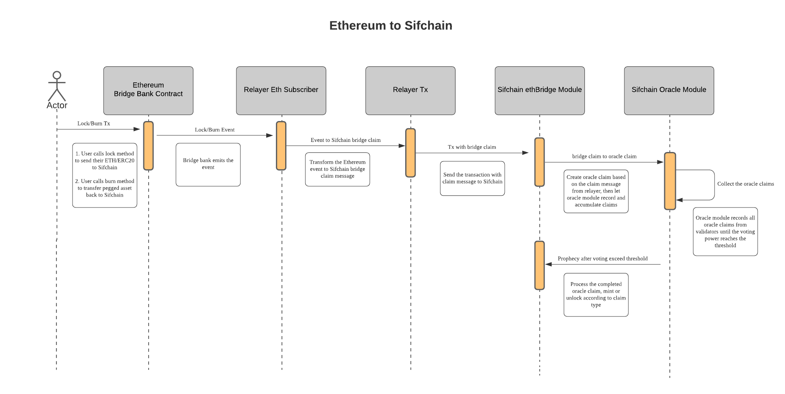

# Sifchain &lt;&gt; Ethereum Bridge

## Definitions

* **Relayer**: A piece of middleware that listens to transactions on one chain and submits them to another chain. This relayer will listen to events on both the Ethereum and Sifchain blockchain.
* **BridgeBank**: A smart contract on Ethereum where users will unlock, lock, mint and burn funds to transfer them across the chains.
* **BridgeToken**: An ERC20 token that is created by the BridgeBank to represent a Sifchain native asset on Ethereum. BridgeTokens are minted by the BridgeBank whenever a user transfers a Sifchain native asset to Ethereum.
* **LogLock**: An event that is triggered when an Ethereum native asset is locked in the BridgeBank contract.
* **LogBurn**: An event that is triggered when a Sifchain native asset is burned from the BridgeBank contract.
* **MsgLock**: A Sifchain event that signals that a Sifchain native asset has been locked.
* **MsgBurn**: A Sifchain event that signals that an Ethereum native asset has been burned.
* **ProphecyClaim**: A transaction that tells us that a certain amount of coins should be sent to someone. This event is triggered by a lock or burn transaction on one chain, then the relayer submits this prophecy claim to the receiving chain.
* **Validators**: Whitelisted Ethereum addresses who submit new prophecy claims.
* **Valset**: A smart contract that stores the whitelist of validators and their powers.
* **Oracle**: A smart contract that stores the current amount of sign off on a given prophecy claim.
* **CosmosBridge**: A smart contract on Ethereum where validators will submit new prophecy claims to unlock or mint assets on Ethereum.
* **Validator Power**: The weight a single validator has on voting for a prophecy claim.
* **Consensus threshold**: The percent of validators power that must sign off on a prophecy claim for it to mint or unlock assets on the Ethereum side.

## Overview

Peggy is a cross-chain bridge that currently moves assets from Ethereum to Sifchain, and from Sifchain to Ethereum.

To move assets from Ethereum to Sifchain, the relayer subscribes to the BridgeBank smart contract deployed on Ethereum and listens for the LogLock and LogBurn messages. When the relayer receives lock or burn messages, it waits 50 blocks to ensure that the transaction is still valid, then submits new prophecy claims to Sifchain. Other relayers then sign off on that prophecy claim and then once enough relayers have approved the prophecy claim, the assets are minted and sent to that Sifchain recipient.

To move assets from Sifchain to Ethereum, the relayer subscribes to the cosmos chain and listens for MsgLock and MsgBurn event. Once that event is heard, a new ProphecyClaim is submitted to the Ethereum CosmosBridge smart contract. Once enough validators sign off on the prophecy claim such that the consensus threshold is met, the funds are unlocked or minted on the Ethereum side.

## Smart contracts

Please note that only the whitelisted validators in the valset smart contract can submit or sign off on prophecy claims on Ethereum.

On the Ethereum side of the world, we maintain smart contracts that will lock and burn funds to move them across the bridge. There are many smart contracts, this is the high-level flow from eth to Sifchain:

1. User locks up funds in BridgeBank smart contract
2. Relayer hears the event generated from the BridgeBank contract
3. Relayer submits a new prophecy claim to mint assets on the cosmos side of the world.

When a user transfers value from Sifchain to Ethereum this is what the flow looks like:

1. User locks or burns assets on the cosmos side of the world.
2. Relayer hears this transaction and submits a new prophecy claim to the CosmosBridge smart contract
3. Other relayers sign off on this transaction.
4. Once enough relayers sign off on this prophecy claim and the consensus threshold is reached, one of two things happen. If this was a sifchain native asset being moved across the bridge, then we will mint assets for that user through the BridgeBank. If this asset being moved across the bridge was an Ethereum native asset, then the BridgeBank will unlock those funds and send them to the user specified in the prohpecy claim.

## Smart contract Architecture

Currently, the smart contracts are upgradeable which allows us to fix them should any bugs arise. In time, the control of these smart contracts will be handed over to SifDAO for control or the admin abilities completely removed for full decentralization.

## Usage Steps

### Initialization

Setup the Bridge chain, add accounts, start the Bridge chain, and test available commands.

[https://github.com/Sifchain/peggy/blob/develop/docs/setup-bridge-chain.md](https://github.com/Sifchain/peggy/blob/develop/docs/setup-bridge-chain.md) 

### Setup Peggy Locally

Start local Ethereum blockchain, compile and deploy contracts, activate the contracts, and get the registry contract's deployed address.

[https://github.com/Sifchain/peggy/blob/develop/docs/setup-eth-local.md](https://github.com/Sifchain/peggy/blob/develop/docs/setup-eth-local.md) 

### Run the relayer

Start the relayer with a validator account in order to relay lock and burn events between the EVM blockchain and the Cosmos SDK blockchain.

[https://github.com/Sifchain/peggy/blob/develop/docs/setup-relayer.md](https://github.com/Sifchain/peggy/blob/develop/docs/setup-relayer.md) 

### Ethereum to Cosmos asset transfers

With a local Ethereum blockchain running, you can participate in Ethereum -&gt; Cosmos asset transfers by starting the Relayer service and acting as a validator. Validators witness the locking of Ethereum/ERC20 assets and sign a data package containing information about the lock, which is then relayed to the Cosmos chain and witnessed by the EthBridge module. Once a quorum of validators have confirmed that the transaction's information is valid, the funds are released by the Oracle module and transferred to the intended recipient's address. In this way, Ethereum assets can be transferred to Cosmos-SDK based blockchains.

Start the Relayer service, send lock transaction containing local assets to the contracts, and test ERC20 support.

[https://github.com/Sifchain/peggy/blob/develop/docs/ethereum-to-cosmos.md](https://github.com/Sifchain/peggy/blob/develop/docs/ethereum-to-cosmos.md) 

### Using Peggy with the Ropsten testnet

Setup interfacting with the Ropsten testnet, deploy contracts to Ropsten testnet, start the Relayer service on the Ropsten testnet, and send lock transaction containing Ropsten testnet assets to the contracts.

[https://github.com/Sifchain/peggy/blob/develop/docs/setup-eth-ropsten.md](https://github.com/Sifchain/peggy/blob/develop/docs/setup-eth-ropsten.md) 

### Cosmos to Ethereum asset transfers

Cosmos -&gt; Ethereum asset transfers are facilitated by a reverse process where validators witness transactions on tendermint and sign a data package containing the information. Cosmos assets can be locked, resulting in the release of funds held on Ethereum, or burned, resulting in the minting of new ERC20 tokens on Ethereum which represent the burned assets. The data package containing the validator's signature is then relayed to the contracts deployed on the Ethereum blockchain. Once enough other validators have confirmed that the transaction's information is valid, the funds are released/minted to the intended recipient's Ethereum address. In this way, assets on Cosmos-SDK based blockchains can be transferred to Ethereum.

Setup interfacing with tendermint, start the Relayer service, start the Oracle Claim Relayer service, burn assets on tendermint, create prophecy and oracle claims on Ethereum, and process prophecy claims



### **Using the application from rest-server**

First, run the cli rest-server

`ebcli rest-server --trust-node`

An api collection for [Postman](https://www.getpostman.com/) is provided [here](https://github.com/Sifchain/peggy/blob/develop/docs/peggy.postman_collection.json) which documents some API endpoints and can be used to interact with it.

Note: For checking account details/balance, you will need to change the cosmos addresses in the URLs, params and body to match the addresses you generated that you want to check.

### **Using the modules in other projects**

The ethbridge and oracle modules can be used in other cosmos-sdk applications by copying them into your application's modules folders and including them in the same way as in the example application. Each module may be moved to its own repo or integrated into the core Cosmos-SDK in future, for easier usage.

## Architecture

[Peggy Architecture MVP](https://github.com/Sifchain/peggy/blob/develop/docs/sifchain-peggy-architecture-no-ibc.md)

[Peggy Architecture with IBC](https://github.com/Sifchain/peggy/blob/develop/docs/sifchain-peggy-architecture.md)

### Sifchain -&gt; Ethereum Bridge

### Ethereum -&gt; Sifchain Bridge

## **Future Goals**

Supporting blockchains besides Ethereum

Implementing the [Model Extensions](https://docs.google.com/document/d/1pZjyQo4THIf-Y9NwZs3JDvUvw1UaBP353TXhn5OJb9w/edit#heading=h.iyqldg8jokar) to Peggy including

* Decentralizing to a permissionless blockchain
* Implementing service rates, overcollateralization, or any other cost support mechanism primitives

Adding Ethereum fee reduction or other features from [Althea Peggy](https://blog.althea.net/tag/peggy/).

Deploy Peggy with its own IBC-compatible blockchain separate from Sifchain. This blockchain is called a peg zone \(more specifically, the Ethereum - Cosmos Peg Zone\). The peg zone interfaces with Sifchain via [Inter-Blockchain Communication](https://cosmos.network/ibc).

