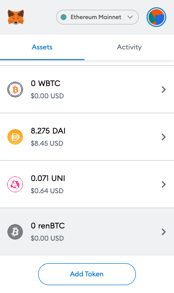

# FAQ

## What is ROWAN and what is eROWAN?

**ROWAN** will be the functional token of the Sifchain network. Sifchain derives its internal asset price from CLPs and uses ROWAN as the settlement token. Traders must directly or indirectly purchase Rowan in order to execute trades against CLPs. For example, the USDC:BTC internal price is calculated using the USDC:RWN and RWN:BTC CLPs. ROWAN can be used for a variety of different actions within the Sifchain ecosystem, including: 

* To stake a node and earn block rewards
* To delegate to a staked node and earn a commission of block rewards.
* To execute a swap from one token to another. Swaps will cost fees, of which are paid via ROWAN.
* To add liquidity to a pool and earn swap fees accrued within that pool. 

For more details on the usage of ROWAN, please refer [here](https://medium.com/sifchain-finance/uses-for-rowan-the-polyvalent-token-for-omni-chain-decentralized-exchange-dex-3207e7f70f02). 

**eROWAN** is the equivalent token of ROWAN on the Ethereum network. Users are able to transfer their ROWAN to eROWAN between the Ethereum and Sifchain networks via Peggy. 

## How can I acquire ROWAN and/or eROWAN

In order to hold ROWAN/eRowan you will first need a wallet to custody the tokens. See Wallet section for more on wallets.

When the Sifchain network is live you will soon be able to buy ROWAN/eRowan on decentralized exchanges \(DEXs\) and centralized exchanges \(CEXs\). 

Here is a list of known exchanges that support ROWAN/eRowan:

* [Uniswap](https://app.uniswap.org/#/swap) \(DEX\) — _coming soon_
* [BitMax](https://bitmax.io/en/global-digital-asset-platform) \(CEX\) — _coming soon_

## What wallets support ROWAN/eROWAN?

**ROWAN** is a token that exists within the Sifchain ecosystem, therefore you will need a Sifchain address to hold these tokens. Since Sifchain is built with the Cosmos SDK, you can use the Keplr wallet to generate a Sifchain address and custody your ROWAN. Reference our instructions on how to setup your Keplr Wallet [here](https://docs.sifchain.finance/resources/sifchain-dex-ui#setup-or-integrate-your-sifchain-address-via-keplr-wallet-integration).

**eROWAN** is an ERC-20 token that exists within the Ethereum ecosystem, therefore you will need an Ethereum address to hold these tokens. At the moment, we are supporting [MetaMask](https://metamask.io/download.html). 

## How can I setup a Sifchain address in order to acquire ROWAN and use the Sifchain-DEX?

There are a few different ways you can setup a Sifchain address. This address is needed to be able to acquire any Sifchain native token \(including ROWAN and all pegged tokens in the Sifchain ecosystem\). In order to get a Sifchain address, you can:

1. Use the Sifchain-DEX-UI and use our Keplr Wallet integration to setup a new Sifchain address. For directions on this, please refer to our instructions [here](https://docs.sifchain.finance/resources/sifchain-dex-ui#setup-or-integrate-your-sifchain-address-via-keplr-wallet-integration).
2. If running on K8s, Use [ruby](https://www.ruby-lang.org/en/documentation/installation/) to run the below two commands:
   1. `rake "keys:generate:mnemonic"` - This will generate a mnemonic for you.
      1. **Important:** write this mnemonic phrase in a safe place. It is the only way to recover your account if you ever forget your password.
   2. Take this generated key and run: `rake "keys:import[<moniker>]"`
      1. This will give you your newly generate Sifchain address.
3. If running locally, run Command `sifnodecli keys add <name>`.  This command will give you your: address, public key, and mnemonic phrase. 

## How can I view my eROWAN in my MetaMask Wallet?

Since eRowan is a new token, it will not appear in the default list of tokens displayed by MetaMask. There is an easy way to fix this in 3 steps:

1. From the main view in MetaMask, scroll down on the “Assets” tab and select “Add Token”

2. Select the “Custom Token” tab and input the Token Contract Address for eRowan — _\[contract address coming soon\]_, then select Next.

3. Confirm the token by selecting “Add Tokens” on this final screen.

## How can I convert my eROWAN to ROWAN?

In order to convert your eROWAN to ROWAN, you will use Peggy. Find out more information about Peggy [here](https://docs.sifchain.finance/core-concepts/peggy). In order to utilize this functionality, we have put a front-end in place for you to easily convert your Ethereum assets into Sifchain assets \(in this case, your eROWAN into ROWAN\).  For step-by-step directions on how to do this via our Front-end portal, reference here \(Casey to input link to FE guide here\). 

## 

