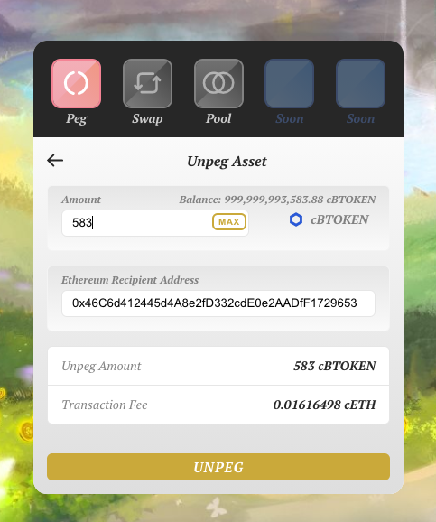
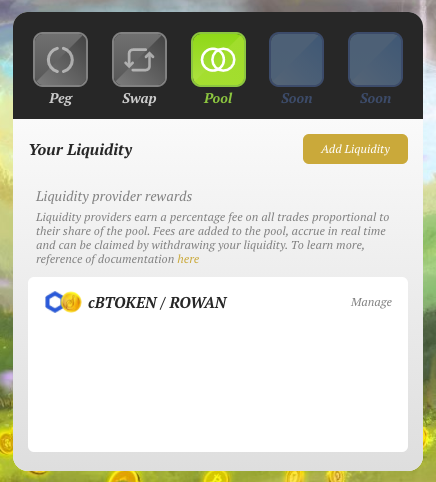
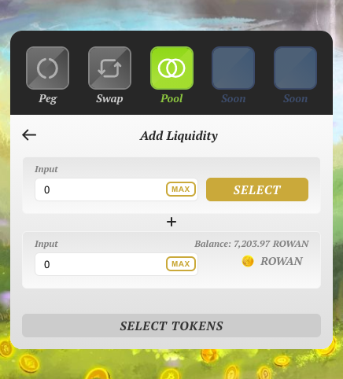
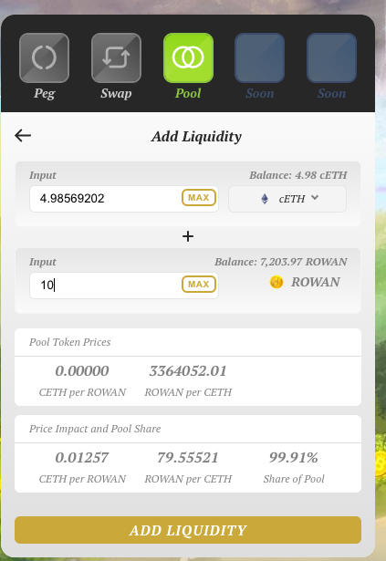
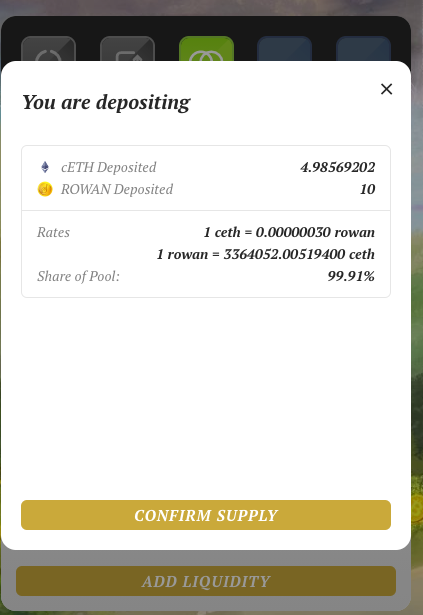
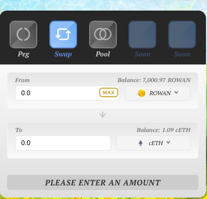
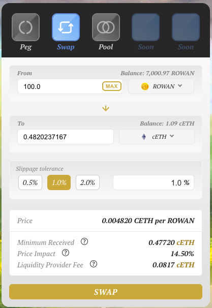
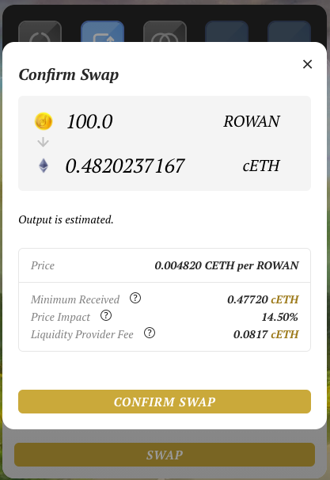

# Sifchain DEX User Guide

## Welcome

Welcome to the Sifchain DEX! This is your portal to interact with the Sifchain system and enjoy all of the great features it has to offer. Read below for helpful 'how-to' guides for anything and everything you can do through this portal. 

## Getting Started

In order to take full advantage of the Sifchain DEX, you must have a Keplr wallet for managing assets on Sifchain and a MataMask Wallet for managing assets on Ethereum.

### Create or Import a Sifchain Address with Keplr Wallet 

Keplr is the official wallet for ROWAN and is required to perform Swaps, Pooling and Pegging on the Sifchain DEX. We recommend you use Google Chrome or Brave Browser from this point forward. 

1. Install the [Keplr Browser Extension](https://chrome.google.com/webstore/detail/keplr/dmkamcknogkgcdfhhbddcghachkejeap) 
2. Open Keplr to add a Sifchain address to your wallet in one of the following ways:
   1. Create new account
      1. Within Keplr click on 'Create new account'
      2. On the next screen, we suggest that you choose a 24 word mnemonic for security purposes. Ensure you write down this 24 word mnemonic you've been given. 
      3. Give your account a new account name. 
      4. Add a password. Then click "Next".
      5. Now you will need to re-enter your 24 word mnemonic. 
   2. Import existing account
      1. Within Keplr click on the 'Import existing account'
      2. On the next screen, input your mnemonic and your account name.
   3. Import ledger
      1. Within Keplr click on the 'Import ledger'
      2. On the next screen, enter in your account name and click 'Next' 
      3. Cconnect your ledger and open the Cosmos app.
         1. For additional directions on ledger app setup, please see [directions here](https://stakingfac.medium.com/cosmos-keplr-guide-ledger-d71e9dded29d).
3. Next, navigate to the Sifchain DEX and click on 'Connect Wallet'. Then click on 'Keplr' 
4. Keplr should jump forward asking for you to Approve the 'Chain Add Request'. If you do not see this, please make sure the extension is enabled by clicking on the Keplr icon in upper right-hand corner. You may have to reload the page.
5. Approve the "Chain Add Request"
6. Approve the "Requesting Connection"
7. Success. A notification should now say "Sif Account Created"
   1. Note: You will get this message regardless if you simply added your existing Sifchain account, or if you create a new account. 

Your Sifchain address is now secured by the Keplr wallet which is now connected to the Sifchain DEX. You can now interact with Sifchain DEX.

To see additional information about your account, click on the Keplr browser extension, select Sifchain in the dropdown chain options. This will show your Sifchain account name, your address, and your balances. You can also add additional accounts here, or simply switch accounts if you have multiple Sifchain addresses.

### Connect your MetaMask Wallet

In order to use our Peggy feature and to move assets from the Ethereum blockchain over to the Sifchain blockchain \(and vice-versa\), you will need to connect to your MetaMask wallet:

1. Navigate to the Sifchain DEX and click on 'Connect Wallet'. Then click on 'MetaMask'
2. Similar to Keplr, follow the MetaMask prompts to connect your Metamask wallet. 

Once you have connected both of your Metamask and Keplr wallets, you are now ready to peg liquidity into Sifchain and use all of the features Sifchain DEX has to offer!

## Pegging Assets

In order to move assets between Sifchain and an external Blockchain, you will use the 'Peg' feature. A few key things to understand about this feature:

* **Gas Fees**
  * 1\) In order to peg assets from Etheruem to Sifchain, you will need some ETH in order to pay for the gas fees to execute this transaction.
  * 2\) In order to unpeg assets from Sifchain back to Ethereum, you will need cETH in order to pay for the gas fees to execute this transaction.
* **Time it Takes to Execute a Transaction**
  * In order for a pegged transaction to be recognized, it needs to go through 50 Ethereum confirmations. This means that this transaction can take anywhere between 10 and 20 minutes to be recognized on Sifchain.
  * Unpegging assets from Sifchain back into Ethereum requires significantly fewer confirmations and should only take ~1 minute to be recognized on Ethereum.

### Peg Assets into Sifchain - Tutorial

After connecting your Keplr and MetaMask wallets, you are now ready to move assets between Ethereum and Sifchain. Sifchain has a [list of allowable tokens](list-of-allowable-tokens-in-sifchain.md) that can be transferred into Sifchain. We will continuously add new tokens based on user feedback and market conditions. In order to move any of these allowable Ethereum assets into the Sifchain network, please follow the below steps.

* Once in the Sifchain DEX, go to the 'Peg' feature.

* On the 'External Tokens' list, you will see a list of all available tokens that you are able to 'Peg' into Sifchain as well as your correlated balances in those tokens. 
* Click on the 'PEG' button next to the token you want to move into Sifchain. This will bring you to the next screen:

* Input the amount of that token you want to peg. Feel free to use the 'Max' button which will auto-fill the amount with the maximum amount of that token you have to peg. We have automatically called in your Sifchain address as the recipient address of these pegged tokens.
* Next, click 'Peg'. This will bring up another confirmation screen:

* Once you confirm the details are correct, you can confirm the Peg. Please note that pegging an asset from Ethereum into Sifchain needs to go through 50 Ethereum block confirmations. For this reason, this action can take upwards of 20 minutes. Please be patient. You should see the amount you want to peg be deducted from your Ethereum address shortly after you execute the transaction. But you will not see the amount appear in your Sifchain wallet until it has gone through all 50 confirmations.

You are now free to use your newly pegged tokens via swaps, or by providing liquidity!

### Unpeg Assets from Sifchain - Tutorial

* You are free to move your pegged assets back into your Ethereum wallet at any time. To do this, go to the 'Peg' screen and click on the 'Sifchain Native' token tab:

* Here you will see a list of all your Sifchain Native tokens and your balances in those tokens. 
* Click on the 'UNPEG' button next to the token you want to move back into your Ethereum wallet. This will bring you to the next screen:

* Now you can input the amount of that token you want to unpeg. Feel free to use the 'Max' button which will auto-fill the amount with the maximum amount of that token you have to unpeg. We have automatically called in your Ethereum address as the recipient address of these unpegged tokens. Once you input an amount, it will display the associated transaction fee that must be paid in cETH. Ensure you have enough cETH in your Sifchain wallet to pay for this fee.
* Next, click 'Unpeg'. This will bring up another confirmation screen:

* Once you click confirm, you will need to sign the transaction via your Keplr wallet. After this, you can see the adjusted token amounts within a minute in your wallets and within the 'Peg' screen.

## Pooling Assets

Users can add any of their tokens to a liquidity pool and earn rewards for doing so. To learn more about the core concept of liquidity pools, how we at Sifchain use them, and details around why one would want to provide liquidity, please refer to our documentation here on [Sifchain Liquidity Pools](https://docs.sifchain.finance/core-concepts/liquidity-pool) and [Liquidity Providers](https://docs.sifchain.finance/roles/liquidity-providers).

### Adding Liquidity

After connecting your Keplr and MetaMask wallets, and you have assets within Sifchain, you are now ready to add liquidity to our liquidity pools. Sifchain has a [list of allowable tokens](list-of-allowable-tokens-in-sifchain.md) that can be used within Sifchain. This list will be ever-evolving as we will continuously add new tokens based on user feedback and market conditions.

* To begin the 'add liquidity' process, navigate to the 'Pool' option within the Sifchain DEX. Here you will see a screen that looks like the one shown here:

* This screen shows the following:
  * A list of liquidity pools that you currently have liquidity in. 
  * The ability to click and 'Manage' your existing pool. This will show you the total amount in that pool, your pool share, and give you the ability to add/remove liquidity from that pool. We will discuss the option further down this page under the 'Manage Liquidity' section.
  * The ability to click and 'Add Liquidity' to a new pool \(or an existing pool\).
* To add liquidity to a pool, click 'Add Liquidity'. This will take you here:

* Here you will want to select which token you will want to use to add liquidity. You can only add liquidity with a Sifchain Token and Rowan. Click on the 'Select' button to see a list of allowable tokens with which you have a balance.
* Once you select the token with which you want to pool, you will now see your available balance. You may input any amount or click the 'Max' button which will automatically call in your total balance of that token.

* IF the pool you are adding liquidity to already exists, then you do NOT need to add both your selected token and ROWAN. You may choose to add asymmetrically to the pool if you desire. You can also choose to add both your selected token and ROWAN to the pool as well if you desire. 
* IF the pool does not exist yet, then you must put some amount of the selected token AND ROWAN to initiate the pool. This will set the initial prices of the pool.
* Once you input your desired amounts, you will see some displayed statistics on the pool:

* The 'Pool Token Prices' display the prices of the tokens as they are in the pool at this very moment.
* The 'Price Impact and Pool Share' display what those prices will be IF you were to execute your adding of liquidity. This will also show you the percentage of the pool you will own if you execute the add.
* Now you can click 'Add Liquidity' and see another confirmation screen:

* Once you 'Confirm Supply', this will initiate your Keplr wallet for you to sign the transaction. Once successful, you will now see this listed pool in Your Liquidity pairs to manage. This may take a few moments to be recognized:

### Manage Liquidity

In the case you already have liquidity in a pool, you will be able to see the pool you have added to in the 'Your Liquidity' list and you can now 'manage' that liquidity. 

* If you click on 'Manage', you will see information about the pool and your position in it:

* The 'Total Pooled' displays the total amount of those tokens that exist in the pool. 
  * This 'Total Pooled' will contain the fees and rewards collected for this pool in real-time. This is so liquidity providers 'own' their percentage of these amounts and can withdraw them at any time. 
* The 'Your pool share' shows the percentage of that pool that you 'own' and can withdraw at any time. 
* You can use these amounts to determine the value of the pool that you own. 
* From here, you can add additional liquidity to the pool by clicking 'Add Liquidity'. For directions around this action, please see the 'Adding Liquidity' section above.
* You can also choose to 'Remove Liquidity' which we will discuss below.

### Remove Liquidity

* If you click on the 'Remove Liquidity' button, you will be taken to a screen that looks like the one here:

* Here you will identify two different amounts:
  * 1\) The percentage of your ownership you want to withdraw.
  * 2\) In which asset you want to withdraw that ownership in.
* For example, you can choose to withdraw all 100% of your ownership in equal parts ROWAN and other Token. 
* In the 'You should Receive' section, this will display the amount of each token you will receive based upon the two amounts you selected.

* You can finalize this withdrawal by clicking on the 'Remove Liquidity'. This will trigger you to sign the transaction via your Keplr wallet. Once finalized, you will now see these amounts in your wallet and your liquidity pool share and amounts adjusted accordingly.  

## Swapping Assets

In Sifchain, users can swap any asset to any other asset \(given there is liquidity pooled for those assets\) via the 'swap' functionality. After connecting your Keplr and MetaMask wallets, and you have assets within Sifchain, you are now ready to use the swap functionality. 

* Navigate to the 'Swap' option. Here you will see a screen that looks like the one shown here:

* This is where you can select what token you want to swap for another token. 
  * The 'From' field is the token you will be providing via the swap.
  * The 'To' field is what token you will be receiving via the swap. 
* Once you select a token you want to swap 'From' and 'To,' you will see your current balances of these tokens. 
* As you input and change the number in the 'From' field, the 'To' field is automatically calculated based on the prices of those tokens as determined by the liquidity pools. 
  * You can also adjust the number in the 'To' field to represent how much of that you want to receive and the number in the 'From' field will be automatically calculated.
* Once you input your desired amount, you will see additional information and details regarding the swap:

* Slippage tolerance:
  * This is the amount of change in price you are willing to accept while still allowing the transaction to execute. Slippage occurs when other users' transactions are processed in between the time you submit a transaction and the time it is confirmed on the blockchain.
* Price:
  * This will show you at what price you are receiving the token you are swapping for.
* Minimum Received:
  * This shows you the minimum amount that you will receive of the 'To' token based upon the slippage tolerance you have accepted.
* Price Impact:
  * This is the percentage impact to the amount of the 'To' token in the liquidity pool based upon how much you are swapping for.
*  Liquidity Provider Fee:
  * This represents the fee that is retained in the liquidity pool to be paid to the liquidity providers.
* Once you click 'Swap', you will see a confirmation screen:

* You can now confirm the swap, sign the transaction via your Keplr wallet and see the amounts adjusted in your wallet.

