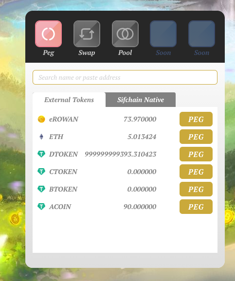
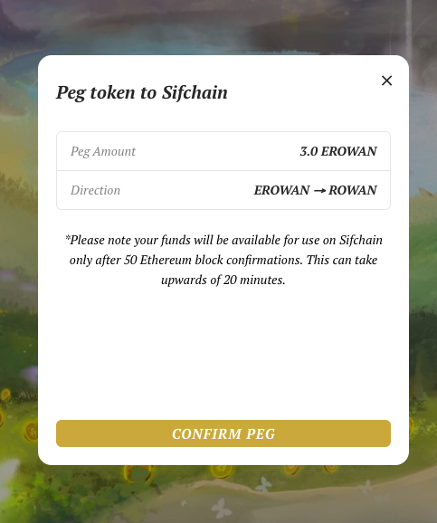
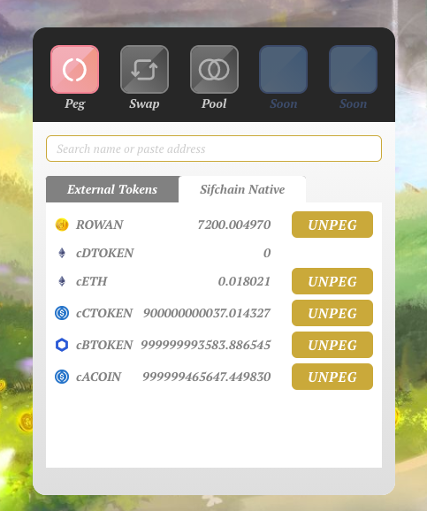
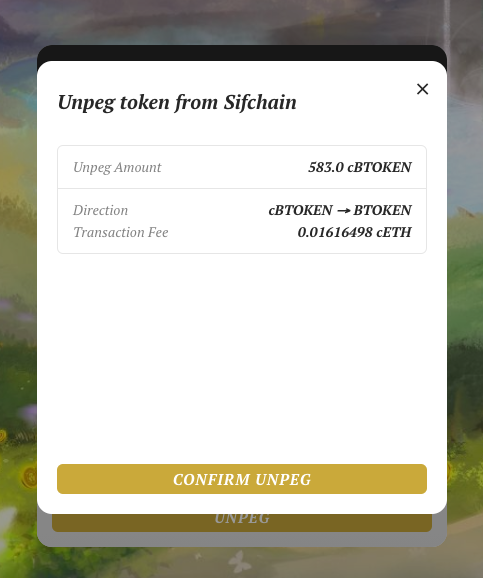

# Sifchain-DEX-UI

## Welcome

Welcome to the Sifchain-DEX-UI! This is your portal to interact with the Sifchain system and enjoy all of the great features it has to offer. Read below for helpful 'how-to' guides for anything and everything you can do through this portal. 

## Getting Started

In order to take full advantage of the Sifchain-DEX-UI, there are a few immediate things you should do once navigating to our portal:

### Setup or Integrate your Sifchain Address via Keplr Wallet Integration. 

Keplr will enable Swaps, Pooling and Pegging on the Sifchain network's user interface. We recommend you use Google Chrome or Brave Browser from this point forward. 

1. Install the Keplr Browser Extention: 

   [https://chrome.google.com/webstore/detail/keplr/dmkamcknogkgcdfhhbddcghachkejeap](https://chrome.google.com/webstore/detail/keplr/dmkamcknogkgcdfhhbddcghachkejeap)

2. Now we want to add a Sifchain address to our Keplr Wallet.  Navigate to the Sifchain-DEX-UI. Click the Keplr icon in the top right portion of your browser. If you don't see it, click the puzzle piece, then enable it. You may need to "reload to enable extension" depending on your security settings. Choose your option here:
   1. Create new account
   2. Import existing account
   3. Import ledger
3. If you need to create a new Account click on 'Create new account':
   1. On the next screen, we suggest that you choose a 24 word mnemonic for security purposes. Ensure you write down this 24 word mnemonic you've been given. 
   2. Give your account a new account name. 
   3. Add a password. Then click "Next".
   4. Now you will need to re-enter your 24 word mnemonic. 
   5. Congratulations! You now have a Keplr wallet.
4. If you need to import an existing Sifchain address, click on the 'Import existing account' option:
   1. On the next screen, input your mnemonic and your account name.
5. If you need to import an existing ledger account, click on the 'Import ledger' option:
   1. On the next screen, enter in your account name and click next. 
   2. Then connect your ledger and open the cosmos app.
6. Next, navigate to the Sifchain-DEX-UI and click on the 'Not Connected' button in the upper right-hand corner. Click on 'Keplr'. 
7. A pop-up should open asking for you to Approve the 'Chain Add Request'. If you do not see this, please make sure the extension is enabled by clicking on the Keplr icon in upper right-hand corner. You may have to reload the page.
8. Approve the chain "Chain Add Request" pop-up.
9. Approve the "Requesting Connection" pop-up.
10. Success. A notification should now say "Sif Account Created"
    1. Note: You will get this message regardless if you simply added your existing Sifchain account, or if you create a new account. 
11. You are now signed in with your Sifchain address. To see additional information about your account, click on the Keplr browser extension, select Sifchain in the dropdown chain options. This will show your Sifchain account name, your address, and your balances. You can also add additional accounts here, or simply switch accounts if you have multiple Sifchain addresses.

### Integrate your Metamask Wallet

In order to use our Peggy feature and to move assets from the Ethereum blockchain over to the Sifchain blockchain \(and vice-versa\), you will need to also connect to your Metamask wallet:

1. After navigating to Sifchain-DEX-UI, click on the 'Not connected' button in the upper right-hand corner.
2. Click on 'Metamask'
3. Follow the screen prompts to connect your Metamask wallet. 
4. Once you have connected both of your Metamask and Keplr wallets, you are now ready to use all of the features Sifchain-DEX-UI has to offer!

## Pegging Assets

In order to move assets between Sifchain and an external Blockchain, you will use the 'Peg' feature. A few key things to understand about this feature:

* **Gas Fees**
  * 1\) In order to peg assets from Etheruem to Sifchain, you will need some ETH in order to pay for the gas fees to execute this transaction.
  * 2\) In order to unpeg assets from Sifchain back to Ethereum, you will need cETH in order to pay for the gas fees to execute this transaction.
* **Time it takes to execute a Transaction**
  * In order for a pegged transaction to be recognized, it needs to go through 50 confirmations. This means that this transaction can take anywhere between 10 and 20 minutes to be fully recognized.

### Pegging Tutorial

* After connecting your Keplr and MetaMask wallets, you are now ready to move assets between Ethereum and Sifchain.
* Sifchain has a list of allowable tokens that can be transferred into Sifchain. This list will be ever-evolving as we will continuously add new tokens based on user feedback and market conditions. Please find that [list here](https://docs.sifchain.finance/resources/allowable-list-of-tokens-in-sifchain).
* In order to move any of these allowable Ethereum assets into the Sifchain environment, please follow the below steps.
* Once in the Sifchain-DEX-UI, go to the 'Peg' feature.

* On the 'External Tokens' list, you will see a list of all available tokens that you are able to 'peg' into Sifchain and your correlated balances in those tokens. 
* Click on the 'PEG' button next to the token you want to move into Sifchain. This will bring you to the next screen:

* Now you can input the amount of that token you want to peg. Feel free to use the 'Max' button which will auto-fill the amount with the maximum amount of that token you have to peg. We have automatically called in your Sifchain address as the recipient address of these pegged tokens. But you are free to change this address to any Sifchain address.
* Next, click 'Peg'. This will bring up another confirmation screen:

* Once you confirm the details are correct, you can confirm the Peg. Please do note that pegging an asset from Ethereum into Sifchain needs to go through 50 Ethereum block confirmations. For this reason, this action can take upwards of 20 minutes. Please do be patient and refresh the screen often. You should see the amount you want to peg be deducted from your Ethereum address shortly after you execute the transaction. But you will not see the amount appear in your Sifchain wallet until it has gone through all 50 confirmations.
* You are now free to use your newly pegged tokens via swaps, or by providing liquidity!

### Un-Pegging Tutorial

* You are free to move your pegged assets back into your Ethereum wallet at any time. To do this, go to the 'Peg' screen and click on your 'Sifchain Native' token tab:

* Here you will see a list of all of the Sifchain Native tokens and your balances in those tokens. 
* Click on the 'UNPEG' button next to the token you want to move back into your Ethereum wallet. This will bring you to the next screen:

* Now you can input the amount of that token you want to unpeg. Feel free to use the 'Max' button which will auto-fill the amount with the maximum amount of that token you have to unpeg. We have automatically called in your Ethereum address as the recipient address of these unpegged tokens. But you are free to change this address to any Ethereum address. Once you input an amount, it will display the associated transaction fee that must be paid in cETH. Ensure you have enough cETH in your Sifchain wallet to pay for this fee.
* Next, click 'Unpeg'. This will bring up another confirmation screen:

* Once you click confirm, you will need to sign the transaction via your keplr wallet. After this, you can see the adjusted token amounts within a few seconds in your wallets and within the 'Peg' screen.

